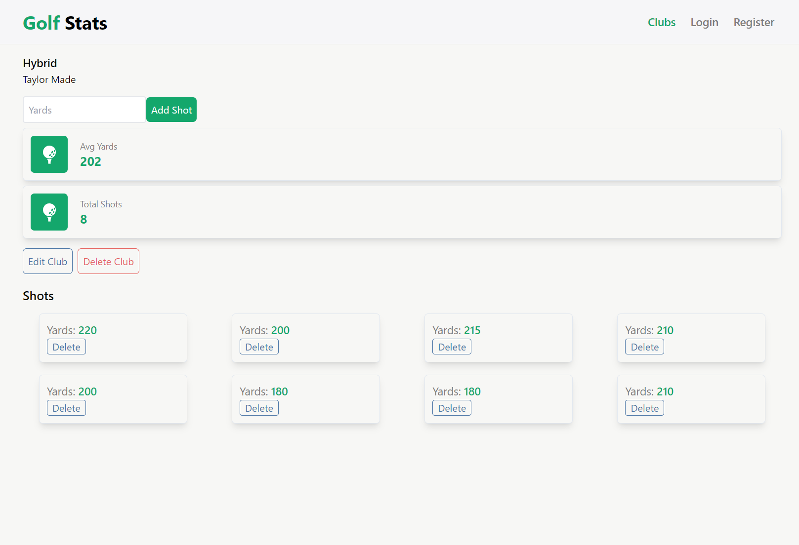
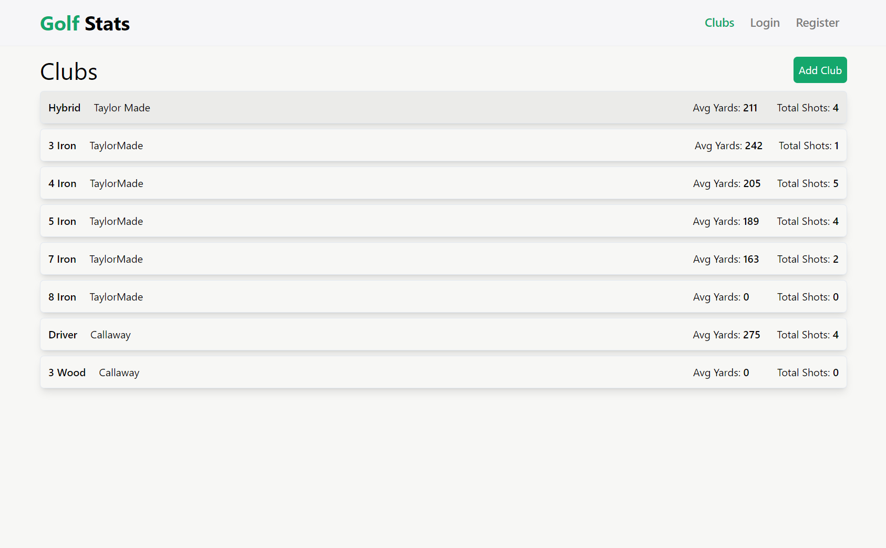
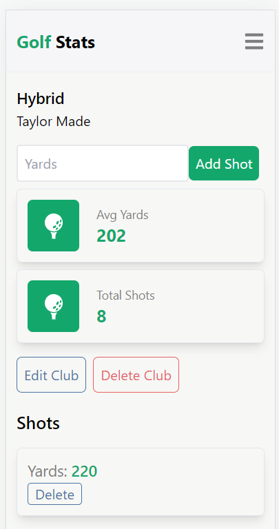

# Golf Stats

Building a full-stack web app that allows users to track their golf stats. 
Users can add their golf clubs in their bag and easily view all clubs. 
User can create, update or delete current stats for each golf club. 

Live version: https://golf-app-v2.herokuapp.com/clubs

## Built with

- React
- React Router V6
- JavaScript
- Tailwind CSS

## To do

-Add User Register / Login
